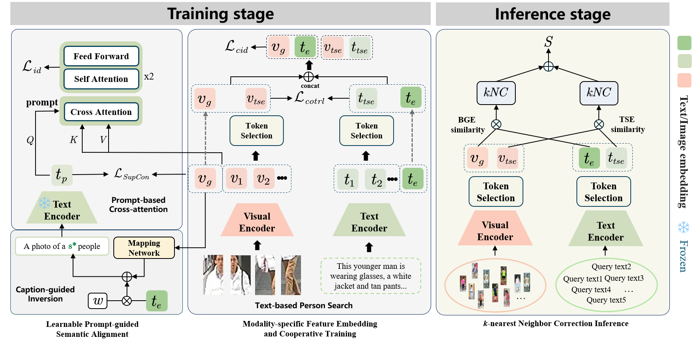

# Learnable Prompts with Neighbor-aware Correction for Text-based Person Search

---

## 🌟 Highlights
- We propose a Learnable Prompts with Neighbor-aware Correction framework that employs dynamic prompt integration and neighbor-aware retrieval correction to enhance text-based person search.
- We design a Learnable Prompt-guided Semantic Alignment module that integrates textual and visual representations into pseudo-tokens, ensuring semantic consistency and bridging the modality gap through a prompt-guided cross-attention mechanism.
- We introduce the  k-nearest Neighbor Correction strategy which adaptively re-adjusts retrieval scores based on the k-nearest neighbor query to enhance retrieval performance without extra training.




## 🚀 Getting Started
### 1. Requirements
```bash
pytorch >= 1.9.0
torchvision >= 0.10.0
prettytable
easydict
```


### 2. Prepare Datasets

Download the CUHK-PEDES dataset from [here](https://github.com/ShuangLI59/Person-Search-with-Natural-Language-Description), ICFG-PEDES dataset from [here](https://github.com/ShuangLI59/Person-Search-with-Natural-Language-Description), and RSTPReid dataset from [here](https://github.com/NjtechCVLab/RSTPReid-Dataset).

Organize them in your `dataset root dir` folder as follows:

```bash
|-- your dataset root dir/
|   |-- <CUHK-PEDES>/
|       |-- imgs
|            |-- cam_a
|            |-- cam_b
|            |-- ...
|       |-- reid_raw.json
|
|   |-- <ICFG-PEDES>/
|       |-- imgs
|            |-- test
|            |-- train
|       |-- ICFG_PEDES.json
|
|   |-- <RSTPReid>/
|       |-- imgs
|       |-- data_captions.json
```

## 🏋️ Training
```bash
bash run.sh
```

## 🧪 Testing
```bash
python test.py
```

## 🙏 Acknowledgments

Some components of this code implementation are adopted from [IRRA](https://github.com/anosorae/IRRA), [RDE](https://github.com/QinYang79/RDE), and [PromptSG](https://github.com/YzXian16/PromptSG). We sincerely appreciate their contributions.


